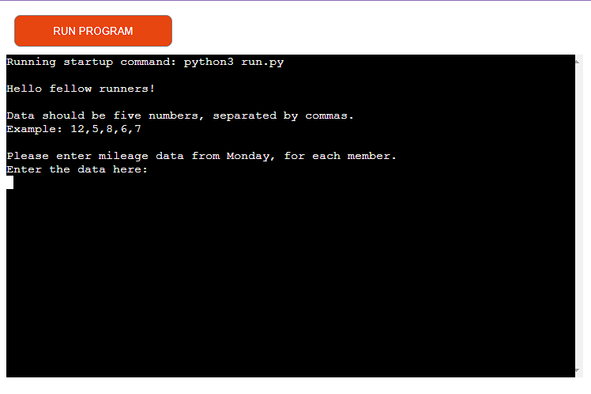
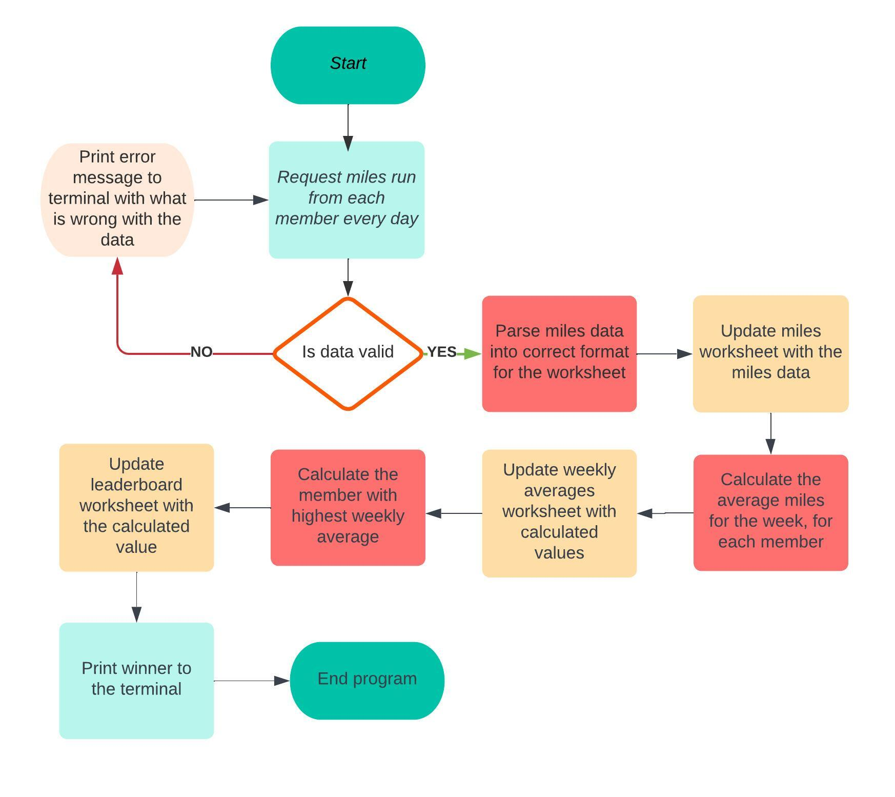
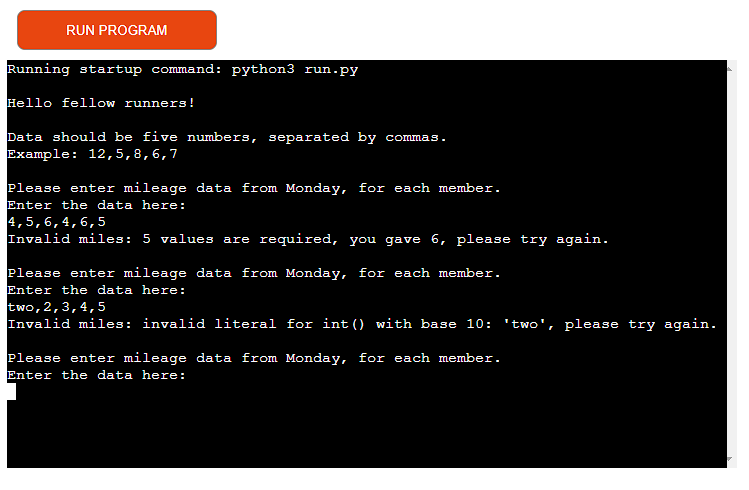
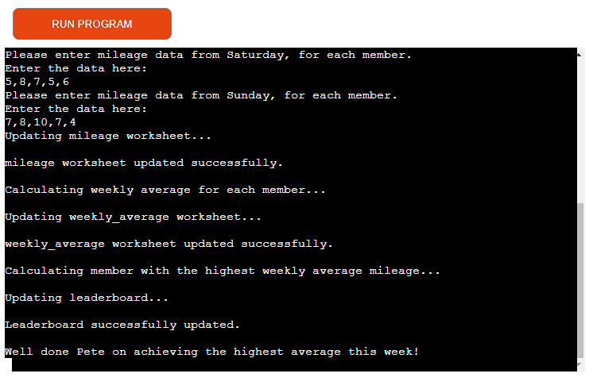
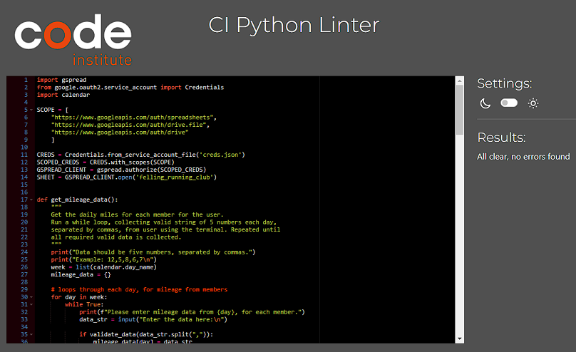

# Project 3 - Felling Running Club

[Felling Running Club](https://felling-running-club-802b152e074f.herokuapp.com/)

A program to help the members of Felling Running Club average their daily miles run, so they can see who has run the most miles on average over the week, and be crowned the winner. 
It runs in the Code Institute mock terminal on Heroku.

The ready to use program.

A screenshot of the flowchart created to figure out the order of the program.

## How to use the program

The members of the running club will provide their mileage data for each day of the week.

Once all the correct data has been submitted, the program will then update the mileage spreadsheet and calculate each members weekly average.

The averages will then be added to the weekly_average worksheet, and those averages will be used to determine the winner for the week.

The winner will then be updated on the leaderboard worksheet, as well as being printed to the terminal.

## Features

### Existing Features

- Greetings to the user
    - Provides instructions on how to give the required data

- Input validation and error checking
    - There are alerts to help the user if the incorrect data is added
    - The user is unable to enter more or less than 5 values
    - The data must be integers

- The outcome printed to the terminal
    - The screen will show the user the program has run successfully
    - It will indicate the spreadsheet has been updated 
    - The winner of the week will be printed to the terminal

### Future Features

- Allow the user to add decimals, for mileage that is not a whole mile

## Data Model

I used gspread as my model. The program uses Google Sheets in order to add and retrieve data, in order to carry out analysis of the data.

Using gspread allows for the use of methods such as `update()` to allow for worksheets to be updated and `append_row()` for ensuring data is added appropriately.

## Testing

I have manually tested this project with the following:

- Passed the code through the PEP8 linter and confirmed there are no problems
- Provided invalid input alerts: too many values entered, or strings when integers are required
- Tested both on my local terminal and on the Code Institute Heroku terminal

### Bugs

#### Solved Bugs

- In the initial stages of writing the code for this project, I noticed it was only asking for one set of 5 values, instead of the 7 needed. 
    - I fixed this by creating a for loop, to go through each day of the week, collecting the data as it went along. 
- Whilst writing the code for this project, I was getting an error due to the days of the week attempting to be updated onto the mileage worksheet, only mileage integers were required. 
    - I fixed this by creating a for loop to extract the required data and converting it to an integer before attempting the update.
- Whilst updating the mileage worksheet, it was adding all the data onto one new row, instead of 7. 
    - I fixed this by creating a for loop that made sure only 5 values were appended onto a row, before a new row was created. 

#### Remaining Bugs

- There are no bugs remaining.

#### Validator Testing

- PEP8 
    - No errors were returned from pep8ci.herokuapp.com

## Deployment

This project used Code Institute's mock terminal for Heroku.

Steps for deployment are as follows:
- Fork or clone this repository
- Create a new app on Heroku
- Add Config Var for the sensitive credentials and port
- Add buildbacks for Python and NodeJS, in that order
- Link the Heroku app to the repository
- Use the Deploy button

## Credits

- Code Institute for the deployment terminal

### Code

- Code Institute: The essentials project helped a lot in figuring out what to do and where I was going wrong.
- Stack Overflow: Helped to iron out some of the creases that the Code Institute content could not help with.

### Content

- All content was written by the developer.

### Acknowledgements

- Kevin, for always being there to keep me motivated.
- Abi, as always, for their continued support.
- Code Instutite, for their fantastic, manageable lessons helping me make sense of everything on this journey.

